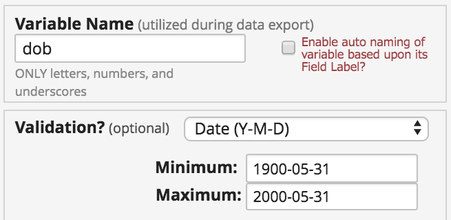
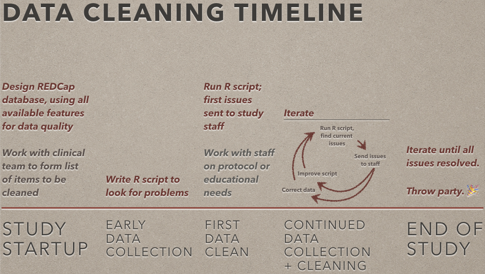
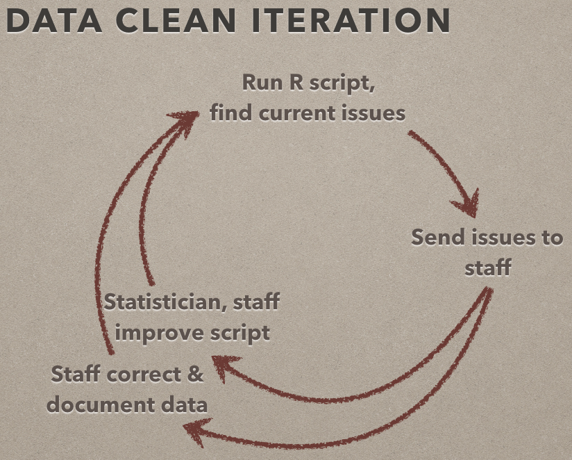
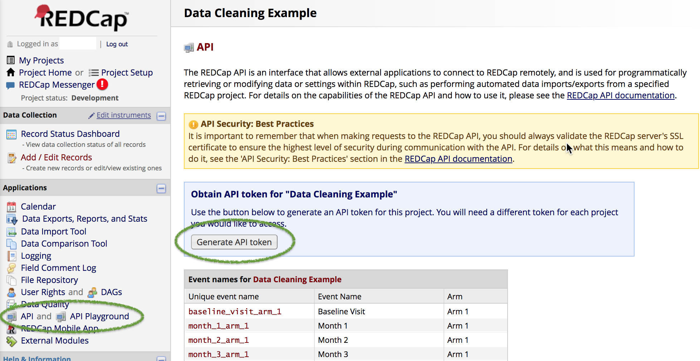
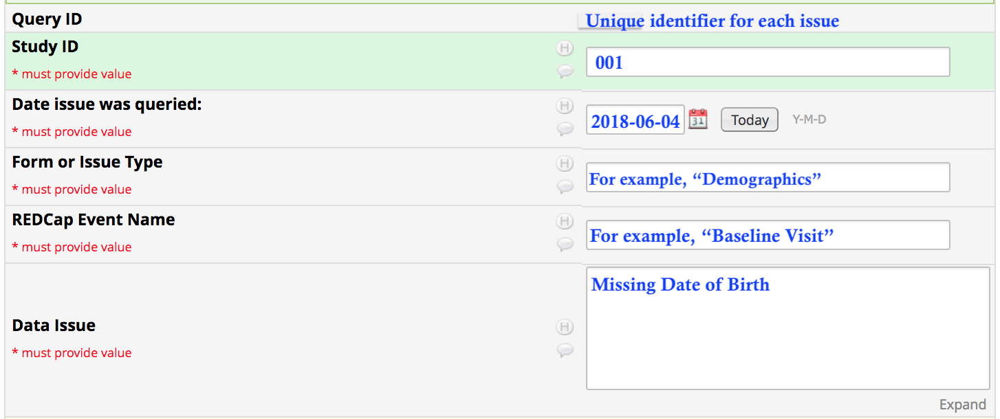
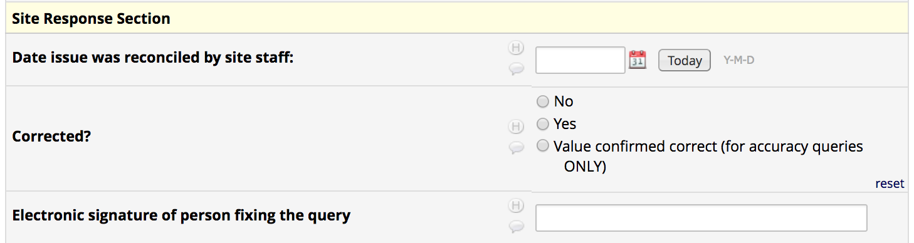
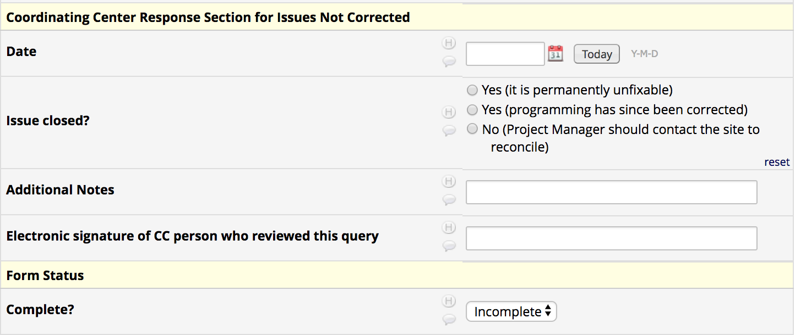
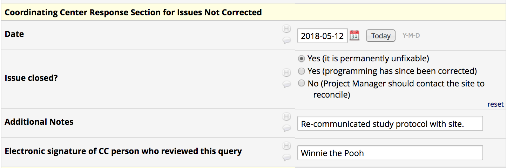
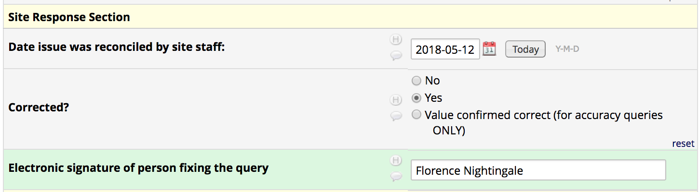
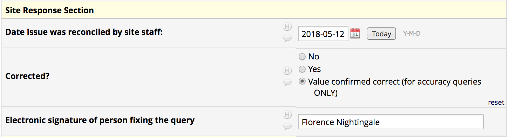

```{r setup, include=FALSE}
knitr::opts_chunk$set(echo = TRUE)
```

# Introduction

## Summary and Goals

This document demonstrates the ongoing process of data cleaning used by the [Vanderbilt CIBS Center](icudelirium.org). Most of our data is stored in
[REDCap](projectredcap.org) databases and is cleaned at multiple points
throughout data collection, with the goal of the highest quality data possible
in the least amount of time once enrollment is complete. Using a toy example,
this tutorial will describe our general process and demonstrate the R code we
use to accomplish this goal.

## Key Points

- First and foremost, take full advantage of REDCap's design features to
*prevent* data entry errors. The following process is helpful for correcting
data entry problems that will always occur, but the more you can *prevent*, the
better.
- This process may seem like it takes a lot of time - and it does, especially at
the beginning. But the end result is worth it: When done well, you will finish
your study with the highest quality data possible, and will save time and pain
by catching systematic problems early. It is especially important for long
and/or multicenter studies, which have more opportunity for staff turnover and
sites entering and leaving the study midway.
- Data cleaning should be performed *early* and *often* to be of the most value.
- The process and the R code will never be perfect or complete from the
beginning - and that is okay! You should expect to update this process in an
iterative manner throughout the course of the study.
- It is incredibly important for the clinical and statistical/database teams to **communicate** during the entire process. This will improve the R code, the
process, and the data.
- For R code specifically:
    - Using REDCap's API allows you to export data automatically every time your
    script is run, saving manual labor and decreasing room for error.
    - Take advantage of REDCap's metadata (data dictionary)! It can help save
    you time and work, especially if the database is designed to take advantage
    of features like data validation.
    - For longitudinal studies, it is very helpful to start off by creating a
    "dummy" dataset, with one record per every patient + event that you expect
    to be present. This can be simple or complicated depending on the study
    design and population, but will be very useful in several ways (we'll see an
    example).

## Notes on the Tutorial

- All code for data export assumes that the user has rights to use the REDCap API for data export, and that a working API token is stored in the `.Renviron` file in the working directory, in the format

    `RCTOKEN=manylettersandnumbers`
    
    If you don't want to use the `.Renviron` file, you can replace `Sys.getenv("RCTOKEN")` with `"manylettersandnumbers"`. If you do this, do not
    share your code - it is very important to keep your API token secret.
    
- The code will use several helper functions, sourced from
`dataclean_helpers.R` in the same working directory/Github repository. The code
will also be copied in an appendix to this document so that the tutorial is
self-contained.

- This script intentionally uses base R (with the exception of the `httr`
package), to maximize adoption and minimize dependencies. Should you care to
refactor with the [tidyverse](tidyverse.org) or other packages, alternate
versions are welcome!

- The primary information and code needed for this process will be within this PDF; all code and files related to this tutorial can be found in [this Github
repository](https://github.com/jenniferthompson/DataCleanExample), which is
public and can be cloned or downloaded as a zip file.

## Motivating Example

This example uses a sample REDCap database for a three-month longitudinal study
of adult patients taking a dietary supplement and measuring creatinine, HDL and
LDL cholesterol, and weight over time. (Sample database is adapted with thanks
from REDCap's project templates.) The study codebook is available
[here](https://github.com/jenniferthompson/DataCleanExample/blob/master/codebook.pdf).

\tableofcontents

# Process Overview

## Study Startup

Our data cleaning process begins during the study startup period, with careful
design of the REDCap database. We take full advantage of features like:

- Data validation rules: These tools can help you ensure that lab values are entered as numbers with no text, or that dates are entered in consistent formats. You can also add minimum and maximum values for numeric and date fields. REDCap has built-in validation for some special types of text, such as
email addresses. For more information, please see REDCap's Help & FAQ page.

{ width=50% }

- Branching logic: This logic tells a specific field when to appear during data
entry. For example, we often use it to ask whether a patient has taken a specific medication; if yes, the branching logic will show a field that allows
us to enter the dose of that medication. Branching logic helps enforce data
collection protocols ("if this, then that should be entered") and helps prevent
data from being accidentally entered in the wrong fields.



During this time, the clinical coordinators and statistics/database team also
work together to develop an initial list of very specific items that should be
checked during the data cleaning process. Depending on the study design, this
can be quite a lot of work! But the more thorough we are in this phase, the
easier the process during the study, and the better the data at the end.

## Early Data Collection

Once study staff has begun entering data into the study database, the
statistician/database team will write the first version of the R script for data
cleaning. (It's very hard to write a script before data is available to test
it!) This is the most time-consuming part of the process for the database team.

## First Data Clean

After a reasonable period of data collection, the statistician/database manager
will run the R script and create the first list of data entry issues to be
corrected or addressed. This can be a scary time for study staff! There will
likely be a few bugs to be worked out, both in the code and in the list of items
to check. It may take a few tweaks before the team is ready to upload the issues
to our documentation database and begin the process of correcting them.
Correcting the data and documenting those steps are the most time-consuming part
of the process for the clinical team.

\newpage

## Continued Data Collection & Cleaning

{ width=50% }

As the study progresses, this process continues: the statistician runs the R
script to find data issues; the study staff corrects or documents issues, and
communicates potential coding issues or new additions back to the statistician,
who then updates the script and repeats the process.

Some changes are coding mistakes or misunderstandings, but others may be the
result of protocol changes, or ideas for new things to check from the project
coordinators, based on interactions with study staff. This maintenance process
takes some time on the part of both the statistician/database team, working to
investigate and debug potential issues or add code for new checks. The following
things are very helpful during this process:

- Agreement that the data clean is a top priority: This doesn't necessarily mean
that it is everyone's most *urgent* priority, but it does mean that everyone
agrees that this is important and should have designated time at an appropriate
date.
- Detail-oriented team members: This is a meticulous process for everyone.
- Strong relationships and open communication between the clinical and
statistics/database team.

## End of Study

Once data collection is finished, we continue to iterate the data cleaning
process until there are no more queries from the R script. At that point, you
should feel free to throw a party.

The rest of this tutorial will focus on the steps of building the R script.

# Step 1: Use REDCap API to Export Raw Data

We use REDCap's API capabilities to export the data automatically every time
the script is run, reducing the potential for error and saving time compared to
manually exporting every time data is cleaned.

## Requirements:

### 1. Working API token

You must have appropriate user rights for your database in order to request an
API token. Once you have the correct user rights, log into the REDCap project.
On the lefthand side under `Applications`, you will see a line for `API and API
Playground`. Click here, then on the button titled `Generate API token`.



Once your token is generated, **never share it with anyone**. It gives you permission and ability to access research data, and should be kept protected at
all times. If you share code with other people, one way to do this safely is to
store your API token in a hidden `.Renviron` file in the appropriate working
directory, like this:

`RCTOKEN=manylettersandnumbers`

You can then access the token using the function `Sys.getenv()`.

For more information on the REDCap API, please see `Project Setup -> Other
Functionality` within an existing REDCap project. For general information on
working with the API, the [Github wiki of the redcapAPI
package](https://github.com/nutterb/redcapAPI/wiki) has a good overview. *(This
example includes basic API usage and will not use the package, but if you are
interested in using more of the API's functionality, it could be a good package
to investigate.)*

### 2. R's `httr` package, built for working with APIs

More information on `httr` can be found in the documentation and vignettes,
linked from [CRAN](https://cran.r-project.org/package=httr). (Everything else in
this tutorial is intentionally in base R to avoid dependencies.)

## Approaches

There are (at least) two approaches to exporting REDCap data:

1. Read in the entire database in a single `httr::POST` call, then create subsets in R as needed
1. Read in specific subsets in separate calls

Approach #1 is fine if your database is not longitudinal, complex, or very
large, and/or if you are not yet comfortable working with the API. Approach #2 is valuable in more complicated situations.

For example, here, our database is longitudinal, and different data is
collected at different time points (for example, date of birth is only
collected at baseline). If we read in the entire database at once, we will have
a lot of missing values (for example, date of birth will be missing at each
monthly visit and study completion, unless we proactively subset the data).

I will show both approaches for reference, but I primarily use Approach 2.
Either way, we want to create the following datasets:

- Baseline data
- Monthly data
- Study completion data

For both approaches, we need this setup:

```{r httr_setup}
## Load httr
library(httr)

## Source helper functions (script should be stored in this working directory)
## Function post_to_df(), which is useful in API code, is stored here, along
## with other helper functions we'll use later
source("dataclean_helpers.R")

## Set URL for REDCap instance (yours may be different)
rc_url <- "https://redcap.vanderbilt.edu/api/"

```

### Approach 1: Example

This approach uses the simplest API call, but needs some R work after exporting
the data.

```{r readdata_1, eval = FALSE}
## Use API + httr::POST to get all data at once
main_post <- httr::POST(
  url = rc_url,
  body = list(
    token = Sys.getenv("RCTOKEN"),
      ## API token gives you permission to get data
    content = "record",        ## export *records*
    format = "csv",            ## export as *CSV*
    rawOrLabel = "label",      ## export factor *labels* vs numeric codes
    exportCheckboxLabel = TRUE ## export ckbox *labels* vs Unchecked/Checked
  )
)

## main_post has class "response"; read it as a CSV to create a data.frame
main_df <- post_to_df(main_post)

## Create subsets with data collected at various time points
baseline_df <- subset(main_df, redcap_event_name == "Baseline Visit")
monthly_df <- subset(main_df, redcap_event_name %in% paste("Month", 1:3))
completion_df <- subset(main_df, redcap_event_name == "Study Completion")

```

Note that unless we spend the time to manually subset them, each of those three
data.frames will have many columns with blank values. For example,
`baseline_df` will have a column for `compliance`, even though `compliance` is
only collected at monthly visits. This is not a major problem if your project
is small, but can be a problem if you have a large project.

### Approach 2

This approach uses three separate `httr::POST` calls to create separate
datasets that are exactly what we need.

REDCap's API Playground can be useful in figuring out which options to include
in the `body` argument of `httr::POST`. (Do note that as of the time of this writing, the example R code from the Playground uses `RCurl`; `httr` is
currently more commonly used and thus it is easier to find documentation and
assistance for it.)

Differences from Approach 1 in the `body` of `httr::POST`:

1. We specify **forms**, using their raw names (eg, `baseline_data` instead of `Baseline Data`).
1. We specify **events**, again using their raw names (eg, `baseline_visit_arm_1` instead of `Baseline Visit`).
1. We always specify `study_id` as a **field** in addition to the other forms. REDCap does not always export the ID by default.

If you are exporting >1 form or event, separate them with commas. You can find
raw event names by going to `Project Setup -> Define My Events` within your
REDCap project, and raw form names by looking at the data dictionary. (They can
also be exported as project metadata using the API; there is an example in
`dataclean_helpers.R`.)

**Note:** The function `post_to_df()`, which creates a data.frame from the
result of `httr::POST`, is created in `dataclean_helpers.R`.

#### Baseline and Demographic Data

This code chunk exports all the fields collected at the baseline visit (the
Demographic and Baseline Visit forms), as well as study ID. It only exports the
Baseline Visit event, because all other events would have `NA` values for these
fields. Therefore, each study ID will have at most one record in this dataset.

```{r baseline_data, eval = FALSE}
## Data from baseline visit only: Demographics and Baseline Data forms
baseline_post <- httr::POST(
  url = rc_url,
  body = list(
    token = Sys.getenv("RCTOKEN"), ## API token gives you permission
    content = "record",            ## export *records*
    format = "csv",                ## export as *CSV*
    forms = "demographics,baseline_data", ## forms
    fields = c("study_id"),               ## additional fields
    events = "baseline_visit_arm_1",      ## baseline visit event only
    rawOrLabel = "label",      ## export factor *labels* vs numeric codes
    exportCheckboxLabel = TRUE ## export ckbox *labels* vs Unchecked/Checked
  )
)

## baseline_post has class "response"; read it as a CSV to create a data.frame
baseline_df <- post_to_df(baseline_post)

## Double-check if you like! Commented out to save space
## baseline_df

```

The `rawOrLabel = "label"` and `exportCheckboxLabel = TRUE` elements in the `body` argument of `POST` are personal preference. I set these to export labels
because I usually find that it is more clear - ie, it is easier to figure out
what `sex == Male` is doing than `sex == 1`. However, depending on your
database and your purposes, you may want to change these to use the raw numeric
codes - for example, if you have fields with very long labels.

#### Monthly Visit Data

This code chunk exports all the fields collected at each monthly visit (the
Monthly Visit form), as well as study ID. It exports all three monthly visit events; all other events will have `NA` values for these fields. Each study ID
will have up to three records in this dataset.

```{r monthly_data, eval = FALSE}
## Data from all monthly visits
monthly_post <- httr::POST(
  url = rc_url,
  body = list(
    token = Sys.getenv("RCTOKEN"),           ## API token gives you permission
    content = "record",                      ## export *records*
    format = "csv",                          ## export as *CSV*
    forms = "monthly_data",                  ## forms
    fields = c("study_id"),                  ## additional fields
    events = paste(sprintf("month_%s_arm_1", 1:3), collapse = ","),
      ## all 3 monthly visit events
    rawOrLabel = "label",      ## export factor *labels* vs numeric codes
    exportCheckboxLabel = TRUE ## export ckbox *labels* vs Unchecked/Checked
  )
)
monthly_df <- post_to_df(monthly_post)

## Double-check if you like! Commented out to save space
## monthly_df

```

#### Study Completion Data

This code chunk exports all the fields collected at study completion, as well
as study ID. It exports only the study completion event; therefore, each study
ID will have at most one record.

```{r completion_data, eval = FALSE}
## Data from study completion visits
completion_post <- httr::POST(
  url = rc_url,
  body = list(
    token = Sys.getenv("RCTOKEN"),     ## API token gives you permission
    content = "record",                ## export *records*
    format = "csv",                    ## export as *CSV*
    forms = "completion_data",         ## form
    fields = c("study_id"),            ## additional fields
    events = "study_completion_arm_1", ## study completion event
    rawOrLabel = "label",      ## export factor *labels* vs numeric codes
    exportCheckboxLabel = TRUE ## export ckbox *labels* vs Unchecked/Checked
  )
)
completion_df <- post_to_df(completion_post)

## Double-check if you like! Commented out to save space
## completion_df

```

## For Demonstration Purposes

To allow you to run the rest of this tutorial, I've stored some toy data in the
same format as our example REDCap databases in the `rawdata/` folder in this
repository, along with a copy of the data dictionary. All are in the same format
we would see if we used the API as described above.

```{r csv_data}
datadict <- read.csv(
  "rawdata/datadict.csv", stringsAsFactors = FALSE, na.strings = ""
)
baseline_df <- read.csv(
  "rawdata/baseline_df.csv", stringsAsFactors = FALSE, na.strings = ""
)
monthly_df <- read.csv(
  "rawdata/monthly_df.csv", stringsAsFactors = FALSE, na.strings = ""
)
completion_df <- read.csv(
  "rawdata/completion_df.csv", stringsAsFactors = FALSE, na.strings = ""
)

```

# Step 2: Create a data.frame of All Issues

This sounds deceptively straightforward, but is the most involved part of this
process. Our goal is to create a single data frame of all potential problems in
our REDCap project as of the date we run the script, which can then be imported
into our documentation database(s) (more on that later) so that the issues can
be resolved.

## Workflow

Typically, I work form by form: here, we'll clean the entire demographic form,
then the entire baseline data collection form, then... This keeps the code in
manageable chunks and makes it easier to both write initially and debug and
maintain as the study progresses.

We often have groups of very similar potential problems: There are many fields that should be present no matter what, for example, and there are several
fields which should be between specific limits. We can write custom functions
to check these types of issues.

Remember: REDCap has many data validation capabilities built in - **use them!**
If your database already checks fields like email for formatting, or gives live
warning if you enter unlikely lab values, it will save you and the study staff
time and headaches later. The same applies to using branching logic often and
well. The added value for this data cleaning script comes from the more complex
data checks that are possible here and not within REDCap itself. But the more
of REDCap's powerful features you can use from the beginning, the better your
data will be throughout the study (eg, for DSMB reports and interim analyses).

\newpage

## Data Management

Several of our error checks will involve comparing dates, or using fields from
different time points. We'll do all this data management here.

```{r datamgmt}
## -- Helper functions; we're doing the same thing a lot -----------------------
## Another reason to make sure all your dates have the same formatting!
date_ymd <- function(x){ as.Date(x, format = "%Y-%m-%d") }
diff_days <- function(x, y){ as.numeric(difftime(x, y, units = "days")) }

## Baseline data
baseline_df$dob <- date_ymd(baseline_df$dob)
baseline_df$date_enrolled <- date_ymd(baseline_df$date_enrolled)

## Dates out of characters
baseline_df$date_visit_b <- date_ymd(baseline_df$date_visit_b)
baseline_df$date_supplement_dispensed <-
  date_ymd(baseline_df$date_supplement_dispensed)

## Calculate days between baseline visit and other milestones
## Creating these variables will make our code later much more readable
baseline_df$days_visit_consent <- with(baseline_df, {
  diff_days(date_visit_b, date_enrolled) })
baseline_df$days_visit_supp <- with(baseline_df, {
  diff_days(date_supplement_dispensed, date_visit_b) })

## Monthly data
monthly_df$date_visit_m <- date_ymd(monthly_df$date_visit_m)

## Study completion data
completion_df$completed_date <- date_ymd(completion_df$completed_date)
completion_df$studywd_date <- date_ymd(completion_df$studywd_date)
completion_df$death_date <- date_ymd(completion_df$death_date)

```

### Dummy Dataset

For many types of checks, it's helpful to have a dataset with every record that
*should* be available for each patient. In our example study, patient 2 has a
baseline record, but no monthly or study completion data. If we clean each form
separately, it would be very hard to realize that this patient is missing that
data.

Therefore, we create a "dummy" dataset with one record per patient per expected
event, and merge this dataset with our other forms as needed. (Depending on the
study design, this can be straightforward or difficult, but it is *always*
helpful!)

```{r dummy_data}
## Create "dummy" datasets that have a record for every patient + time
## This helps us check things like "pt X is missing Monthly Visit 2"
## Knowing the study design is key!

## Lists of all unique IDs, events
## In our case, every patient should have a record for every month, unless they
##  have died or withdrawn, along with baseline data & a study completion form.
##  So we create a dummy dataset with all five events for each patient. Later,
##  we'll also create an indicator variable for whether the patient has died or
##  withdrawn at that point (and therefore should *not* have data entered).
all_ids <- sort(unique(c(
  baseline_df$study_id, monthly_df$study_id, completion_df$study_id
)))
all_events <- c("Baseline Visit", paste("Month", 1:3), "Study Completion")

dummy_df <- data.frame(
  study_id = rep(all_ids, each = length(all_events)),
  redcap_event_name = rep(all_events, length(all_ids))
)

## Merge on relevant dates for each event: enrollment, completion, death,
##  withdrawal - we will use these to help clean things in each form
dates_everyone <- merge(
  subset(baseline_df, select = c(study_id, date_enrolled)),
  subset(completion_df, select = c(study_id, completed_date, death_date, studywd_date)),
  by = "study_id", all = TRUE
)

dummy_df <- merge(
  dummy_df,
  dates_everyone,
  by = "study_id", all.x = TRUE
)
dummy_df <- merge(
  dummy_df,
  subset(monthly_df, select = c(study_id, redcap_event_name, date_visit_m)),
  by = c("study_id", "redcap_event_name"), all.x = TRUE
)

## Merge subsets of dummy data onto individual datasets, to make sure every
## dataset has all the patients/records it's supposed to
## This step also adds dates from baseline and completion forms onto forms where
##  they're needed (eg, adds date of study withdrawal onto monthly form, so we
##  can tell whether they *should* have a monthly visit or not)
baseline_df <- merge(
  subset(
    dummy_df,
    redcap_event_name == "Baseline Visit",
    select = c(study_id, redcap_event_name)
  ),
  baseline_df,
  by = c("study_id", "redcap_event_name"), all.x = TRUE
)

monthly_df <- merge(
  subset(
    dummy_df,
    redcap_event_name %in% paste("Month", 1:3),
    select = -date_visit_m
  ),
  monthly_df,
  by = c("study_id", "redcap_event_name"), all.x = TRUE
)

completion_df <- merge(
  subset(
    dummy_df,
    redcap_event_name == "Study Completion",
    select = c(study_id, redcap_event_name, date_enrolled)
  ),
  completion_df,
  by = c("study_id", "redcap_event_name"), all.x = TRUE
)

## Add an indicator to the monthly form for whether the patient should have a
## form filled out this month. (They should *not* if they have died or withdrawn
## before [month] * 30 days.)
monthly_df$month_num <-
  with(monthly_df, as.numeric(substr(redcap_event_name, 7, 7)))
monthly_df$days_enrolled_actual <- with(monthly_df, {
  diff_days(date_visit_m, date_enrolled) })
monthly_df$date_visit_planned <- with(monthly_df, {
  date_enrolled + (month_num * 30) })
monthly_df$out_of_study <- with(monthly_df, {
  (!is.na(death_date) & death_date < date_visit_planned) |
    (!is.na(studywd_date) & studywd_date < date_visit_planned)
})

## Indicator: Does the patient have any monthly visit data this month?
## Use the data dictionary to save typing!
monthly_vars <- subset(datadict, form_name == "monthly_data")$field_name
## `consent_reminder` is just a reminder field, is not exported
monthly_vars <- setdiff(monthly_vars, "consent_reminder")

monthly_df$any_data <- rowSums(!is.na(monthly_df[, monthly_vars])) > 0

## Create a variable for *last* month's visit, to check hospitalization dates
## Note: There may be better ways to do this in base (maybe split/unsplit?).
## I would usually use dplyr:
## monthly_df %>%
##   group_by(study_id) %>%
##   mutate(last_visit = lag(date_visit_m))
monthly_df$last_visit <- as.Date(
  unlist(
    lapply(
      unique(monthly_df$study_id),
      FUN = function(i){
        df <- subset(monthly_df, study_id == i)
        c(NA, df$date_visit_m[1:(nrow(df) - 1)])
      })
  ),
  origin = "1970-1-1"
)

```

## Demographics Form

The Demographics form is one of the two collected at the baseline visit. In Step 1, we exported it as part of `baseline_df`; this data.frame has one record
per patient. If you take Approach 1 (export everything at once), make sure that
you subset the data to only keep the `Baseline Visit` event.

### 1. Decide what to clean

The first step is to determine what issues need to be looked for. Some of these
are straightforward: for example, every patient should have a date of birth.
Some are more complex or not as obvious, however. **This is where communication
and detail are key.** Typically, our project manager will spend a good deal of
time creating a list of things that need to be checked, based on the study
protocols and goals. It is enormously important for the clinical data team and
the statistician/database manager to overcommunicate at this stage!

For our demographics form, we want to check the following:

- Study ID should always be an integer (no letters or special characters)
- These fields should always be present:
    - Date of consent
    - Consent form
    - All contact information
    - Phone
    - Mood
    - Statins
- Postal code should be properly formatted *(so should email, but REDCap will validate this field automatically - take advantage of REDCap's capabilities when designing your study!)*
- Date of birth should be between 18 and 110 years before consent
- If the patient is female, whether she has ever given birth should be entered
- If the patient has given birth, the number of births should be entered
- If no activity questions are marked, study staff should confirm this (it might be OK, but it is unusual and should be checked)
- If the patient is marked as being on statins, at least one specific statin
should be checked; if the patient is marked as *not* being on statins, *no*
statins should be checked
- Height and weight should both be present and within soft limits set in the database

### 2. Custom error checking (+ demo of the process)

Our next step is to create a `n x 2` data.frame where each row represents one
potential problem; the first column is an error code; and the second column is
the corresponding error message. For example, our error code might be
`id_format`, and the corresponding error message might be `Study ID should be an
integer with at most four digits`.

```{r demog_codes}
## -- Create error codes + corresponding messages for all issues *except* ------
## -- fields that are simply missing or should fall within specified limits ----

## Codes: Short, like variable names
## Messages: As clear as possible to the human reader
demog_codes <- data.frame(
  code = c(
    "id_format", "postcode_format", "dob_limits", "birth_yn", "birth_num",
    "no_activity", "which_statin", "no_statins"
  ),
  msg = c(
    "Study ID should be an integer with at most four digits",
    "Postal code should be formatted properly",
    "Date of birth should be within 18 and 110 years prior to consent",
    "If patient is female, whether she has given birth should be marked",
    "If patient has given birth, number of births should be present",
    "This patient has no activities marked; please confirm or correct",
    "Patient is marked as taking statins, but no specific statins checked",
    "Patient is marked as not taking statins, but at least one statin is checked"
  )
)

```

The second step is to create a matrix with # rows = `nrow(data frame we're checking)`, and # columns = `nrow(data frame of error codes)`. Every column is
logical, indicating whether or not this problem exists at this row in the data.frame. For many issues, we'll do this manually.

```{r demog_setup}
## Preliminary setup: Create empty matrix to hold all potential issues
## Rows = # rows in baseline_df
## Columns = # potential issues
## Everything starts off FALSE
demog_issues <- matrix(FALSE, ncol = nrow(demog_codes), nrow = nrow(baseline_df))
colnames(demog_issues) <- demog_codes$code
rownames(demog_issues) <- with(baseline_df, {
  paste(study_id, redcap_event_name, sep = '; ') })

```

Note that our matrix has specific `rownames` - this will be important later,
especially for longitudinal forms. The rownames are formatted as `study_id; event_name`. Later, we'll separate these rownames into the ID and event fields
to upload to the documentation database.

```{r demog_issues}
## -- Determine true/false for each potential issue ----------------------------
## Study ID, postal codes are checked using regular expressions; set rows which
## do *not* meet the regex to TRUE
## (For regexes, it's easier to do this by using the first-column notation here,
## because of how grep() works. For other custom checks, however, I find it more
## readable to say `df_issues[, "issue_name"] <- [condition]`.)
demog_issues[
  grep("^\\d{1,4}$", baseline_df$study_id, invert = TRUE), "id_format"
  ] <- TRUE
demog_issues[
  grep("^\\d{3}-\\d{4}$", baseline_df$postal_code, invert = TRUE),
  "postcode_format"
  ] <- TRUE

## Date of birth: Should be within 18 and 110 years of consent date
demog_issues[, "dob_limits"] <- with(baseline_df, {
  !is.na(date_enrolled) & !is.na(dob) &
    (diff_days(date_enrolled, dob) < (18 * 365.25) |
       diff_days(date_enrolled, dob) > (110 * 365.25))
})

## Birth questions
demog_issues[, "birth_yn"] <- with(baseline_df, {
  !is.na(gender) & gender == "Female" & is.na(given_birth) })
demog_issues[, "birth_num"] <- with(baseline_df, {
  !is.na(given_birth) & given_birth == "Yes" & is.na(num_children)
})

## Activity questions: If all are missing, ask site to confirm

## Versions if using API to export: options given download checkboxes as
##  `day of the week` or NA
demog_issues[, "no_activity"] <- rowSums(
  !is.na(
    baseline_df[,grep("^(gym|aerobics|eat|drink)\\_[0-6]$", names(baseline_df))]
  )
) == 0

## Statins
demog_issues[, "which_statin"] <- baseline_df$any_statins == "Yes" &
    rowSums(!is.na(baseline_df[, paste0("which_statins_", 1:9)])) == 0
demog_issues[, "no_statins"] <- baseline_df$any_statins == "No" &
    rowSums(!is.na(baseline_df[, paste0("which_statins_", 1:9)])) > 0

# ## Versions if using manually exported CSV "labels" format: exports checkboxes
# ##  as `Checked` or `Unchecked`
# ## Activity
# demog_issues[, "no_activity"] <- rowSums(
#   baseline_df[,grep("^(gym|aerobics|eat|drink)\\_[0-6]$", names(baseline_df))] == "Checked"
# ) == 0
# 
# ## Statins
# demog_issues[, "which_statin"] <- baseline_df$any_statins == "Yes" &
#     rowSums(baseline_df[, paste0("which_statins_", 1:9)] == "Checked") == 0
# demog_issues[, "no_statins"] <- baseline_df$any_statins == "No" &
#     rowSums(baseline_df[, paste0("which_statins_", 1:9)] == "Checked") > 0

demog_issues

```

Success! The next step is to take our matrix, look for only the actual errors
(`TRUE` values), and combine them into a data.frame with one row per actual
error. To do this, we create a data.frame for every column in `demog_issues`
with one row per `TRUE` value, then bind all those rows together.

Because we'll be doing this frequently, there is a helper function,
`create_error_df()`, in `dataclean_helpers.R` to do it for us. The function
takes as inputs our `error_codes` and `error_matrix`, and returns a data.frame
with one row per actual problem.

```{r demog_df}
demog_errors <- create_error_df(
  error_matrix = demog_issues, error_codes = demog_codes
)

demog_errors

```

### 3. Simple checks: Are these fields present?

One of the most common issues we check is simply whether every record has a
certain field that should always be present. For example, in our Demographics
form, every patient should have date of birth and gender, among other fields.

Because these checks are so common, I have a helper function, `check_missing()`,
that lets us do it easily. It follows the same basic steps as we did for our
custom checks, but every check is `is.na(df[, x])`, and every error message is
"Missing [field label]." It takes as inputs our data.frame, a character string
of variables to check, and the data dictionary, from which it gets variable
labels to create the full error message.

(Variable labels can be very helpful in error messages! No matter how
descriptive your field names are, your data entry team is used to seeing
"Subject Global Assessment," not "sga_b". With little effort, you can make their
lives much easier and also make the data cleaning process much faster. Here, the
data dictonary is imported in `dataclean_helpers.R`, using a process similar to
the one we used to download our raw data, and stored as the object `datadict`.)

```{r demog_missing}
demog_missing <- check_missing(
  df = baseline_df,
  variables = c(
    "date_enrolled", "patient_document", "family_name", "given_name",
    "street_address", "city_prefecture", "postal_code", "phone", "email",
    "dob", "gender", "mood", "any_statins", "height", "weight", "bmi"
  ),
  ddict = datadict
)

demog_missing

```

### 4. Check for Values Outside Limits

We have several numeric fields that we want to make sure fall within reasonable
limits (or if they do not, that the values are confirmed to be correct). For
example, it would be very easy for someone to enter a height of 19 centimeters
when they actually meant 190 centimeters. REDCap has built-in data validation
rules, and you should take full advantage of them - this will make data entry
errors much harder. However, it is still possible to enter incorrect values,
especially if you forget to build these rules into the design of the database
from the beginning. It will also give you more confidence in these outlying
values at the time of analysis if these outliers are checked during the process,
rather than waiting until the point of analysis, when study staff may no longer
be available or you have to make quick decisions.

The `check_limits_numeric()` function in `dataclean_helpers.R` follows a very
similar process to `check_missing()`. The difference is that you can specify
minimum and maximum allowed values for each variable, using either the limits
set in the REDCap data dictionary, or a custom data.frame.

Let's take a look at the way the relevant columns in the data dictionary are
formatted:

```{r head_datadict}
subset(
  datadict,
  field_name %in% c("study_id", "dob", "height", "weight"),
  select = c(
    field_name, field_label, field_type,
    text_validation_type_or_show_slider_number,
    text_validation_min, text_validation_max
  )
)

```

All four of the fields we've chosen to display are `text` fields, but with
different validation types. `study_id` is purely text; `dob` is text that must
be formatted as a date; `height` and `weight` are numeric/integer text.
`check_limits_numeric()` currently only works with numeric field types; if you
have several dates/times in your database, you could certainly write a second
version to work with dates.

We'll use these already-specified limits to check for extreme values in height
and weight. Since we want to use the default values, using this function looks
very similar to `check_missing()`:

```{r demog_limits}
demog_limits <- check_limits_numeric(
  df = baseline_df,
  variables = c("height", "weight"),
  ddict = datadict
)

demog_limits

```

Later we'll have an example where we specify custom limits.

### 5. Combine All Issues

That's all we want to check for the Demographics form, so we'll combine these data.frames into a single one for ease.

```{r demog_combine}
demog_final <- do.call(rbind, list(demog_missing, demog_limits, demog_errors))
demog_final$form <- "Demographics"

## demog_final

```

## Baseline Visit Form

This process will be very similar to the Demographics form process above. We'll
be making sure that:

- Date of visit is recorded, and is on or within a week of consent
- Creatinine present, within 0.3 - 9
- HDL cholesterol present, within 20-100
- LDL cholesterol present, within 30-300
- Weight present, within 35-200
- Two plasma, two serum variables answered
- Subject Global Assessment answered
- Date patient begins supplement answered, after date of baseline visit

### Things aren't missing

We actually want to check that *everything* is present. We can save ourselves
some typing by taking advantage of the data dictionary.

```{r baseline_missing}
## Get all the variables in the Baseline Visit form
baseline_vars <- subset(datadict, form_name == "baseline_data")$field_name

## Now see if they're missing
baseline_missing <- check_missing(
  df = baseline_df,
  variables = baseline_vars
)

## baseline_missing

```

### Things aren't extremely large or small

We have several lab values and patient characteristics measured at this visit.
If we look at the data dictionary, all of these fields have limits entered (which is great!), but the limits for creatinine are very generous (someone with a
creatinine of 20 mg/dL would be *very* sick). We'll create a data frame with
our own limits (which in real life, we would do after talking with our clinical
collaborators).

```{r baseline_limits}
baseline_limit_vars <- paste0(c("creat", "hdl", "ldl", "drywt"), "_b")

baseline_limit_df <- data.frame(
  var = baseline_limit_vars,
  min_val = c(0.5, 20, 30, 35),
  max_val = c(10, 100, 300, 200)
)

baseline_limits <- check_limits_numeric(
  ## These arguments are similar to previous example
  df = baseline_df,
  variables = baseline_limit_vars,
  ddict = datadict,
  ## These arguments are how we supply our own limits:
  ##  df_limits = data.frame; cname_min, cname_max = columns in df_limits with
  ##  minimum, maximum limits
  df_limits = baseline_limit_df,
  cname_min = "min_val",
  cname_max = "max_val"
)

## baseline_limits

```

### Custom checks

We just have a couple of other things to check, using custom code for each.

```{r baseline_issues}
## -- Create error codes + corresponding messages for additional issues --------
baseline_codes <- data.frame(
  code = c("visit_consent", "visit_supp"),
  msg = c(
    "Baseline visit should occur within one week of consent",
    "Supplement start date should be on or within one week of baseline visit"
  )
)

## -- Issues matrix: in this case, two columns ---------------------------------
## Rows = # rows in baseline_df
## Columns = # potential issues
## Everything starts off FALSE
baseline_issues <- matrix(
  FALSE, ncol = nrow(baseline_codes), nrow = nrow(baseline_df)
)
colnames(baseline_issues) <- baseline_codes$code
rownames(baseline_issues) <- with(baseline_df, {
  paste(study_id, redcap_event_name, sep = '; ') })

## -- Determine true/false for each potential issue ----------------------------
baseline_issues[, "visit_consent"] <- with(baseline_df, {
  !is.na(days_visit_consent) &
    (days_visit_consent < 0 | days_visit_consent > 6)
})
baseline_issues[, "visit_supp"] <- with(baseline_df, {
  !is.na(days_visit_supp) & (days_visit_supp < 0 | days_visit_supp > 6)
})

baseline_errors <- create_error_df(baseline_issues, baseline_codes)

```

```{r baseline_combine}
## -- Combine all baseline errors into a final data.frame ----------------------
baseline_final <- do.call(
  rbind, list(baseline_missing, baseline_limits, baseline_errors)
)
baseline_final$form <- "Baseline Data"

```

## Monthly Visit

This form will go mostly the same as the two before, even though the form is
collected at multiple time points. We'll check at every visit:

- At least some data exists for each month, unless patient has withdrawn or died
- Date of visit is recorded and is at within X months (+/- one week) of enrollment
- Creatinine present, within 0.3 - 9
- HDL cholesterol present, within 20-100
- LDL cholesterol present, within 30-300
- Weight present, within 35-200
- Number of treatments missed (out of 8) present
- % compliance present
- number of treatments should be between 0-8 and “match” % compliance
- Hospitalization (y/n) present
- If hospitalized, cause, dates, discharge summary questions present
- If hospitalized, dates should be between last and current visit
- Date of hospital discharge should be after date of admission

```{r monthly_errors}
## -- Custom checks ------------------------------------------------------------
## Create error codes + corresponding messages
monthly_codes <- data.frame(
  code = c(
    "incomplete_visit", "extra_visit", "visit_date", "trt_comp",
    "hosp_cause_miss", "hosp_adm_miss", "hosp_dis_miss", "hosp_sum_miss",
    "hosp_lastvisit", "hosp_adm_dis"
  ),
  msg = c(
    "Patient has not died or withdrawn, but has no data for this month",
    "Patient died or withdrew before scheduled monthly visit, but has data",
    "Date of monthly visit not within X months (+/- one week) after enrollment",
    "Number of treatments missed does not match % compliance",
    "Patient hospitalized since last visit, but missing cause of hospitalization",
    "Patient hospitalized since last visit, but missing admission date",
    "Patient hospitalized since last visit, but missing discharge date",
    "Patient hospitalized since last visit, but missing whether summary filed",
    "Hospital admission date is prior to last visit",
    "Hospital discharge date is prior to admission date"
  )
)

monthly_issues <- matrix(
  FALSE, ncol = nrow(monthly_codes), nrow = nrow(monthly_df)
)
colnames(monthly_issues) <- monthly_codes$code
rownames(monthly_issues) <- with(monthly_df, {
  paste(study_id, redcap_event_name, sep = '; ') })

## Determine true/false for each potential issue
monthly_issues[, "incomplete_visit"] <- with(monthly_df, {
  !out_of_study & !any_data })
monthly_issues[, "extra_visit"] <- with(monthly_df, out_of_study & any_data)
monthly_issues[, "visit_date"] <- with(monthly_df, {
  !is.na(days_enrolled_actual) &
    (days_enrolled_actual < ((month_num * 30) - 7) |
       days_enrolled_actual > ((month_num * 30) + 7))
})
monthly_issues[, "trt_comp"] <- with(monthly_df, {
  !is.na(trt_missed) & !is.na(compliance) & (
    (compliance == "99-75 percent" & trt_missed > 2) |
    (compliance == "74-50 percent" & !(trt_missed %in% 3:4)) |
    (compliance == "49-25 percent" & !(trt_missed %in% 5:6)) |
    (compliance == "0-24 percent" & !(trt_missed %in% 7:8))
  )
})
monthly_issues[, "hosp_cause_miss"] <- with(monthly_df, {
  !is.na(hosp_yn) & hosp_yn == "Yes" & is.na(hosp_cause) })
monthly_issues[, "hosp_adm_miss"] <- with(monthly_df, {
  !is.na(hosp_yn) & hosp_yn == "Yes" & is.na(hosp_adm) })
monthly_issues[, "hosp_dis_miss"] <- with(monthly_df, {
  !is.na(hosp_yn) & hosp_yn == "Yes" & is.na(hosp_dis) })
monthly_issues[, "hosp_sum_miss"] <- with(monthly_df, {
  !is.na(hosp_yn) & hosp_yn == "Yes" & is.na(hosp_summary_binder) })
monthly_issues[, "hosp_lastvisit"] <- with(monthly_df, {
  !is.na(hosp_adm) & !is.na(last_visit) & hosp_adm < last_visit })
monthly_issues[, "hosp_adm_dis"] <- with(monthly_df, {
  !is.na(hosp_adm) & !is.na(hosp_dis) & hosp_dis < hosp_adm })

monthly_errors <- create_error_df(monthly_issues, monthly_codes)

## -- Missingness checks -------------------------------------------------------
monthly_vars <- c(
  paste0(c("creat", "hdl", "ldl", "drywt"), "_m"),
  "trt_missed", "compliance", "hosp_yn"
)
monthly_missing <- check_missing(
  df = subset(monthly_df, !out_of_study),
    ## takes out visits that shouldn't be there
  variables = monthly_vars
)

## -- Limit checks -------------------------------------------------------------
monthly_limits_vars <-
  c(paste0(c("creat", "hdl", "ldl", "drywt"), "_m"), "trt_missed")

monthly_limit_df <- data.frame(
  var = monthly_limits_vars,
  min_val = c(0.3, 20, 30, 35, 0),
  max_val = c(9, 100, 300, 200, 8)
)

monthly_limits <- check_limits_numeric(
  df = subset(monthly_df, !out_of_study),
  variables = monthly_limits_vars,
  ddict = datadict,
  df_limits = monthly_limit_df, cname_min = "min_val", cname_max = "max_val"
)

## -- Combine all checks -------------------------------------------------------
monthly_final <- do.call(
  rbind, list(monthly_missing, monthly_limits, monthly_errors)
)
monthly_final$form <- "Monthly Data"

```

## Study Completion Form

Each patient should have a study completion form filled out, at the end of the
study or at death or withdrawal, if those events occur before the study's end.
We'll check:

- Study completion (yes/no), date are recorded
- Whether patient withdrew or died are recorded
- If the patient withdrew, whether date and reason are recorded
- If the patient died, whether date and cause are recorded

```{r completion_errors}
## -- All checks ---------------------------------------------------------------
## Since there's only one variable that should be present for everyone, we'll
## just include it in the main section rather than doing a separate call for
## check_missing().

## Create error codes + corresponding messages
completion_codes <- data.frame(
  code = c(
    "miss_comp", "comp_date", "wd_date", "wd_reason", "died_date", "died_cause"
  ),
  msg = c(
    "Missing Has patient completed study?",
    "Patient completed study, but missing date",
    "Patient withdrew, but missing date",
    "Patient withdrew, but missing reason",
    "Patient died, but missing date",
    "Patient died, but missing cause"
  )
)

completion_issues <- matrix(
  FALSE, ncol = nrow(completion_codes), nrow = nrow(completion_df)
)
colnames(completion_issues) <- completion_codes$code
rownames(completion_issues) <- with(completion_df, {
  paste(study_id, redcap_event_name, sep = '; ') })

## Determine true/false for each potential issue
completion_issues[, "miss_comp"] <- is.na(completion_df$completed_study)
completion_issues[, "comp_date"] <- with(completion_df, {
  !is.na(completed_study) & completed_study == "Yes" & is.na(completed_date) })
completion_issues[, "wd_date"] <- with(completion_df, {
  !is.na(studywd_yn) & studywd_yn == "Yes" & is.na(studywd_date) })
completion_issues[, "wd_reason"] <- with(completion_df, {
  !is.na(studywd_yn) & studywd_yn == "Yes" & is.na(studywd_reason) })
completion_issues[, "died_date"] <- with(completion_df, {
  !is.na(death_yn) & death_yn == "Yes" & is.na(death_date) })
completion_issues[, "died_cause"] <- with(completion_df, {
  !is.na(death_yn) & death_yn == "Yes" & is.na(death_cause) })

completion_final <- create_error_df(completion_issues, completion_codes)
completion_final$form <- "Completion Data"

```

## Combine Everything

That's it! Now we combine all our data issues into one data.frame and prepare it
to upload to the documentation database.

```{r combine_issues}
all_issues <- do.call(
  rbind, list(demog_final, baseline_final, monthly_final, completion_final)
)

## Separate study_id, redcap_event_name from id column
id_event <- strsplit(as.character(all_issues$id), "; ")
all_issues$study_id <- unlist(lapply(id_event, FUN = function(x){ x[[1]] }))
all_issues$event <-
  unlist(lapply(id_event, FUN = function(x){ x[[2]] }))
all_issues <- all_issues[order(all_issues$study_id), ]

## Create a unique query number for all issues for each patient
all_issues$querynum <- unlist(
  lapply(
    unique(all_issues$study_id),
    FUN = function(i){ 1:sum(all_issues$study_id == i) }
  )
)

## Add today's date, create total query ID (study_id + date + querynum)
all_issues$date_query <- format(Sys.Date(), "%Y-%m-%d")
all_issues$queryid <-
  with(all_issues, paste(study_id, date_query, querynum, sep = "_"))

## -- Final version to upload: Query ID, pt ID, date, form, event, issue -------
all_issues <- subset(
  all_issues,
  select = c(queryid, study_id, date_query, form, event, msg)
)

## Write out to CSV to more easily look at it - will store this in repo
write.csv(all_issues, "querydata/original_issues.csv", row.names = FALSE)

```

If this is the first time we've run the data clean, we can skip to step 4.

# Step 3: Remove Unfixable Queries

Sometimes, issues with the data are known but cannot be resolved. For example,
if a patient was not weighed at a monthly visit, that value can never be
entered. Repeating these queries forces study staff to re-investigate problems
they have already documented, which is both irritating and a waste of time and effort.

Therefore, an important step in our process is the **documentation** of each
issue. This both serves as a record of why the original data changed and
enables us to **remove** issues which are unfixable or correct from future
data cleans.

## Documentation Project Structure

We document all issues and record their resolution in a separate REDCap
project, which contains at minimum the following fields (example values in
blue):

### Values created by R script

{width=75%}

`Query ID` is typically a combination of patient ID, the date of the data clean, and a number between 1 and the total number of queries found during that data clean.

### Values filled out by study staff

{width=75%}

"Accuracy queries" are those that ask staff to confirm extreme values - for example, "Height is less than recommended minimum of xxx cm; please correct or confirm."

### Values filled out by coordinating center/manager

{width=75%}

"Permanently unfixable" queries are those that relate to data that can never be
recovered; for example, weight is missing at a monthly assessment because the
patient wasn't weighed at all.

Some queries are due to errors in the script or miscommunications between the
coordinating center and the statistician/database manager; as the study
progresses, you will always find new, fun problems! Thus, we allow for this
category of "not fixed."

Depending on the study, it might also be helpful to have additional fields in
the documentation, such as a reason the query was not corrected or whether a
Note to File was recorded.

The example documentation codebook for this project can be found [here](https://github.com/jenniferthompson/DataCleanExample/blob/master/codebook_documentation.pdf).

\newpage

For the purposes of this tutorial, we're going to assume that this is *not* the
first time we've run this script - ie, that there are already a few issues
documented and fixed in the original database. These include:

- Entering a study withdrawal date for patient 2. *This should clear up some
queries, but not baseline ones.*
- Entering an consent date for patient 3. *This should **introduce** a new
query, because the patient's DOB is in 2018 and thus age will be <18 years.*
- Noting that we forgot to weigh patient 3 at baseline; thus that value is
unfixable (`query 3_2018-05-12_2`). *We don't want this to be uploaded again.*

{width=75%}

- Correcting a highly implausible creatinine value at baseline for patient 4A (query 4A_2018-05-12_7; changed from 95 to 9.5). *This will show up in the next
clean, but as a "please confirm that this is accurate" query, because the creatinine value is still above the suggested maximum.*

{width=75%}

- Confirming an outlying creatinine value at Month 1 for patient 4A (query 4A_2018-05-12_11; value of 9.1 was confirmed correct). *This shouldn't show
up in the next clean.*

{width=75%}

Everything else should show up again because it hasn't been fixed. This means that if study staff have not corrected and documented a query before the data clean is run again, the same issue will show up multiple times. In rare cases
this could be a helpful motivator, but in general, it is very important for the
statistics/data team to communicate clearly with clinical/data entry teams about
appropriate timelines for rerunning the script, to avoid unnecessary 
double-entry.

## Pause: Download "Fixed" Data

To continue with the tutorial, we need to replace our three datasets with
versions that include the corrections I detailed above. These files are stored
in the `fixeddata/` directory.

```{r fixed_data}
rm("baseline_df", "monthly_df", "completion_df")

baseline_df <- read.csv(
  "fixeddata/baseline_df.csv", stringsAsFactors = FALSE, na.strings = ""
)
monthly_df <- read.csv(
  "fixeddata/monthly_df.csv", stringsAsFactors = FALSE, na.strings = ""
)
completion_df <- read.csv(
  "fixeddata/completion_df.csv", stringsAsFactors = FALSE, na.strings = ""
)

```

The script `dataclean_partial.R` in this repository essentially runs our data
cleaning code thus far on these three updated datasets, resulting in the file
`querydata/updated_issues.csv`.

```{r source_to_here}
## -- dataclean_partial.R basically gets us to this point in the tutorial, -----
## -- but using "fixed" data ---------------------------------------------------
source("tutorialscripts/dataclean_partial.R")

```
If we compare it to `querydata/original_issues.csv`, we see that:

- Many of the queries for patient 2 are gone, since this patient now is known to
have withdrawn from the study soon after enrollment; however, we still need
several baseline data points to be entered.
- There is no new query for patient 3's consent date, but there is now a query
for his/her age, which we can now calculate.
- There is still a query for patient 3's baseline weight, even though it has
been marked "unfixable."
- There is no longer a query for patient 4A's baseline creatinine value. (If
this were a monthly creatinine, it would have been queried again, because we
used custom minimum and maximum values in the monthly checks. However, at
baseline, we used the limits specified in the REDCap database, which include a
maximum of 20 - well above the new value of 9.5.)
- There is still a query for patient 4A's Month 1 creatinine, even though it has
been marked accurate.

We want to remove the third and fifth queries above so that they aren't
repeated. To do that, we'll export the documentation database so that we can
check it against our new query list.

## Exporting Documentation Data

We download the data in our documentation database in the same way as the raw
data. Note that since it is a separate REDCap project, you will need a separate
API token. Mine is saved in my `.Renviron` file as the object `DOCTOKEN`.

```{r already_checked, eval = FALSE}
## Documentation of queries already checked
doc_post <- httr::POST(
  url = rc_url,
  body = list(
    token = Sys.getenv("DOCTOKEN"),
    content = "record",
    format = "csv",
    rawOrLabel = "label",
    exportCheckboxLabel = TRUE
  )
)
doc_df <- post_to_df(doc_post)

## Double-check if you like! Commented out to save space
## doc_df

```

So that you can continue the tutorial, I've saved the result of the above in the
file `querydata/doc_df.csv`; read it in using:

```{r doc_csv}
## -- Read in CSV version to continue tutorial ---------------------------------
doc_df <- read.csv(
  "querydata/doc_df.csv", stringsAsFactors = FALSE, na.strings = ""
)

```

We now need to merge our current issues (stored in `all_issues`) with our previously documented issues and remove the potential errors which are either
unfixable or actually correct. To be removed from future data cleans, queries
must be marked as accurate in the field `corrected`, or must be confirmed by the
coordinating center as being unfixable in the field `cc_conclusion`. We'll
create an indicator variable for whether each query meets either condition.

```{r flag_queries}
doc_df$remove <- with(doc_df, {
  (!is.na(corrected) &
     corrected == "Value confirmed correct (for accuracy queries ONLY)") |
    (!is.na(cc_conclusion) &
       cc_conclusion == "Yes (it is permanently unfixable)")
})

subset(doc_df, remove)

```

So far so good. Now we need to add that indicator variable onto our new set of
data issues, then remove those two.

```{r merge_fixed}
remaining_issues <- merge(
  all_issues, subset(doc_df, select = c(study_id, form, event, msg, remove)),
  by = c("study_id", "form", "event", "msg"),
  all.x = TRUE, all.y = FALSE
)

## write.csv(remaining_issues, "querydata/remaining_issues.csv", row.names = FALSE)

```

In `remaining_issues`, we have some queries with a value for `remove` of `FALSE` - these queries are *repeated* from our last clean because they have not been corrected. We have some with a value of `NA`; these are *new* queries (for
example, now that patient 3 has a consent date entered, some new queries are
showing up related to it). Finally, we have two queries with `remove = TRUE` -
these are the two queries listed above. Let's remove them and we'll be done!

```{r remove_documented}
upload_issues <- subset(remaining_issues, !(!is.na(remove) & remove == TRUE))

## write.csv(upload_issues, "querydata/upload_issues.csv", row.names = FALSE)

```

# Step 4: Disseminate Issues to Study Staff

Though it is possible to import `upload_issues` directly to our documentation
using the REDCap API, we've found it helpful to do this step manually, because
it is often useful for our primary coordinators to look over the list prior to
uploading for any systematic errors (eg, all a patient's events are off by one)
or opportunities for education or communication with study staff. For example,
if there are many similar issues from the same site, there may be a
misunderstanding about when a piece of data is to be collected or how it is to
be entered. If these queries can be discussed and handled in batches, it will
save both study staff and coordinators time in documentation.

Therefore, we typically separate queries by study site (if the study is
multicenter); send these to the primary coordinators to look over; and then
either upload directly, or wait until the coordinators have resolved systematic
errors with study staff and rerun the data clean once data has been corrected.

Doing these systematic changes before uploading queries does mean that some
changes to the data are not documented. We have found this to be a fine tradeoff
for the number of hours saved documenting the same issue and resolution,
especially given that one can always access data histories for a given field within REDCap itself.

If you do want to import using the API, you can use the following code:

```{r import_remaining, eval = FALSE}
## Write CSV of remaining issues (take out "remove")
write.csv(
  subset(remaining_issues, select = -remove),
  "querydata/api_upload.csv",
  row.names = FALSE
)

httr::POST(
 url = rc_url,
 body = list(
   token = Sys.getenv("DOCTOKEN"), ## token stored in .Renviron
   content = "record",
   format = "csv",
   type = "flat",
   overwriteBehavior = "normal",
   forceAutoNumber = "false",
   data = paste(readLines("querydata/api_upload.csv"), collapse = "\n"),
   returnContent = "count",
   returnFormat = "csv"
 )
)

```

Once the data is uploaded to the documentation database, the staff and coordinators work to resolve and document each issue, leaving the database ready
for the next round of data cleaning.

# Step 5: Iterate!

I mean iteration in two ways.

## Repeat This Process, Early and Often

The more frequently you clean your data, the more prepared you will be for
things like interim analyses and DSMB or progress reports, and the less time
you'll have to spend on data cleaning at the end of the study (when everyone is
very excited about getting the final results!). This is especially important for
multicenter studies or studies that enroll over years, where sites or staff
members may join and leave the group; once a site is closed or a coordinator has
retired, it is (understandably!) a challenge to get effort from that site to
clean data. Besides, no one wants to get a large, overwhelming number of queries
at the end of the study!

How frequently you choose to clean your data will depend on enrollment rates
and how many staff members are available to do the cleaning, but we recommend
repeating this process as often as is reasonable.

## Always Be Improving

Much like your study protocols, your cleaning script will rarely be perfect on
the first try. As the study goes on, you will always find more ways that data
can be "wrong," or have more questions that are inspired by unexpected data or
discussions with study staff, or need to add data checks based on protocol
changes. The vast majority of time spent on this data cleaning script is during
its initial development, but there will always be things that need to be changed
or added.

This is one reason that **communication** between the statistician/database
manager and study staff is hugely important! We work together not only at the
beginning of this process, to design the database and come up with lists of
data points that need to be checked, but throughout study enrollment and data
collection to make sure that protocol changes are adequately accounted for,
misunderstandings are cleared up quickly, etc. Typically, as study staff are
working through one round of data cleaning, I keep a list of things that need
to be investigated - queries they believe shouldn't be there or aren't clear,
queries that need to be added due to a protocol change, etc. Then when it's
time for the next round of data cleaning, I block off some time to investigate
anything that has come up, fix or add what needs attention, and *then* rerun
the next round.

In addition to improving the data itself and the data cleaning script, we use
this process as a way to improve our study documents and staff education: If
there is a piece of data that is systematically showing up as an issue, perhaps it is due to something that was not clearly addressed at the study startup
visit and needs to be revisited, or should be written out fully in an SOP.

# Conclusions & Acknowledgements

Our group recently finished data collection on the first clinical trial we
conducted using this process. I can say with absolute certainty that we were
able to finish data cleaning and lock our database very quickly, with strong
confidence in our data's accuracy, because we prioritized this data cleaning
process throughout the course of the study.

This process would be impossible without the dedicated, reliable work of our
clinical coordinating team and others at the VUMC CIBS Center, as well as the
work of all of our study site coordinators and principal investigators.
Particularly, Brenda Pun, Cayce Strength, Leanne Boehm, and Aimee Hoskins have
played huge parts in making this process a reality, in their roles as project managers and study coordinators.

Cole Beck and Jeremy Stephens have contributed ideas and R code throughout the
time that we have used this process, making our scripts more efficient.

\newpage

# Appendix: `dataclean_helpers.R`

This file contains several "helper functions" which make the processes of
downloading data and checking problems of similar types easier to do and debug. When using the workflow described here, this file should be stored in the same
working directory and sourced within the script, as seen above. It is copied here for convenience.

```{r, code = readLines("dataclean_helpers.R")}
```
