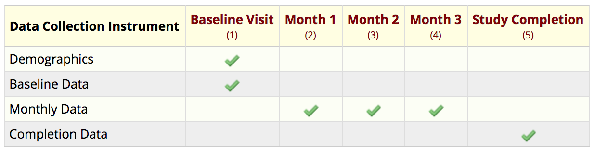

class: inverse, middle, center

# Hello! 👋

I am sorry I could not learn Japanese in time 😔

Please tell me if I need to speak more slowly or repeat something!

---

class: inverse, middle

# Workshop Information

---

# Please ask questions! 🙋🏻

1. Raise your hand any time!
1. Ask in Slack: `#redcappers_r_vu`
1. Sticky notes! Yellow = "I need help", blue = "I'm finished"

---

# Download Files from Github

1. github.com/jenniferthompson/DataCleanExample
1. Click green button, then "download as zip"

Your printed PDF will have everything you need for reference, but if you want to run the code as we go through it today, you will need these files too.

I suggest having `dataclean_script.R` open to follow along. This script (and the tutorial) source `dataclean_helpers.R`, which we will go over in detail if we have time.

We will use `dataclean_partial_ocu.R` once during the workshop.

---

class: inverse, middle

# Context

---

# Who I am

- Senior staff biostatistician at Vanderbilt University Medical Center
- Ayumi was my first boss after graduate school 😊
- Work with the VUMC Center for Critical Illness, Brain Dysfunction and Survivorship (CIBS Center), doing most statistical analysis and working with database team

---

# What is CIBS?

### icudelirium.org

- We study the sickest patients in the hospital:
    - What happens to them in the ICU?
    - What happens to them after they go home?
- Clinical trials, prospective cohort studies, retrospective EMR studies
- Most have data collected in the hospital and during long-term follow-up (several years!)
- Currently have at least six studies in data collection phase, with one just finished

---

# Our Previous Data Cleaning Methods

- Pre-2008: 🤷🏻
- BRAIN-ICU (finished data collection ~2011):
    - R script for in-hospital data, but very manual process
    - Google Docs for follow-up data
- MIND-USA (begin enrolling 2011): This process!

---

class: inverse, middle

# Key Points for Today

(PDF Chapter 1)

---

class: inverse, middle, center

# Prevention > Correction

Use REDCap's built-in features to help you *prevent* data entry mistakes!

---

class: inverse, middle, center

# This process takes a long time.

(especially at the beginning!)

# **It is worth it.**

---

class: inverse, middle, center

# Clean Your Data **Early** and **Often**

---

class: inverse, middle, center

# This Is an Ongoing Process

You will need to update your R script during the study - that is OK!

---

class: inverse, middle, center

# COMMUNICATION IS KEY 🔑

.pull-left[
#### Statistician/database team with clinical coordinators
]

.pull-right[
#### Clinical coordinators with data entry team
]

---

class: inverse, middle, center

# Take advantage of REDCap's tools!

.pull-left[
### Before:
Data validation tools for error prevention
]

.pull-right[
### After:
**Data dictionary** for working with different forms, field labels, numeric limits

**API** for exporting data automatically
]

---

class: inverse, center, middle

# Motivating Example

---

# Motivating Example

- Longitudinal study; baseline + 3 monthly visits + study completion
- Adult patients taking a dietary supplement
- Measures creatinine, HDL and LDL cholesterol, and weight over time

---

class: inverse, middle, center

# Any Questions So Far?

--

Now, to the PDF!

---

class: center, inverse

---

class: center, inverse

